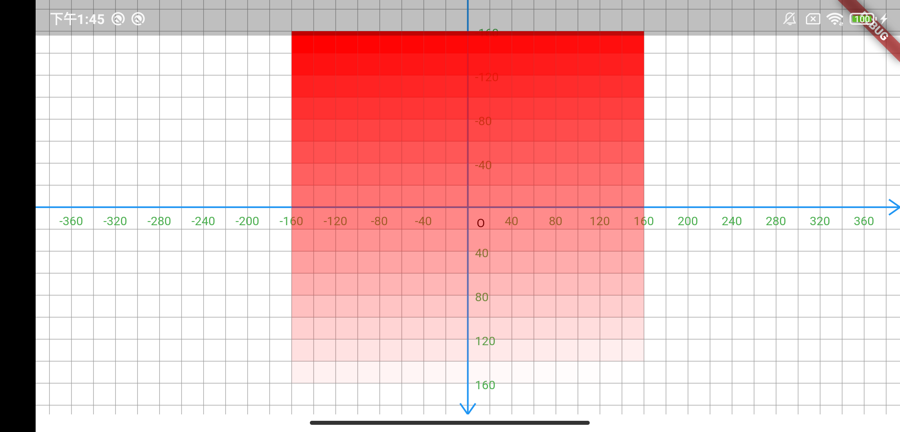
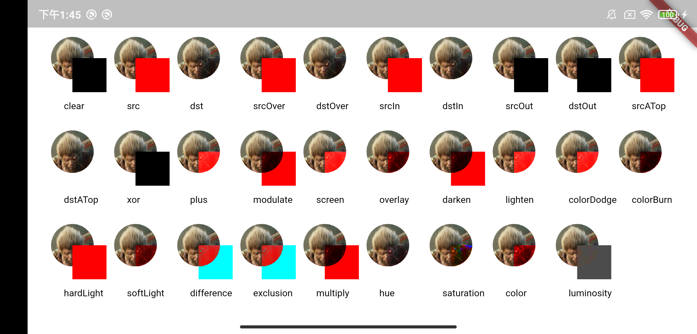
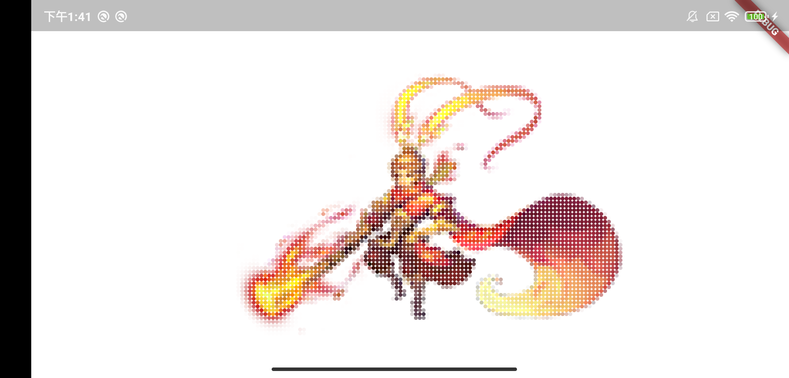
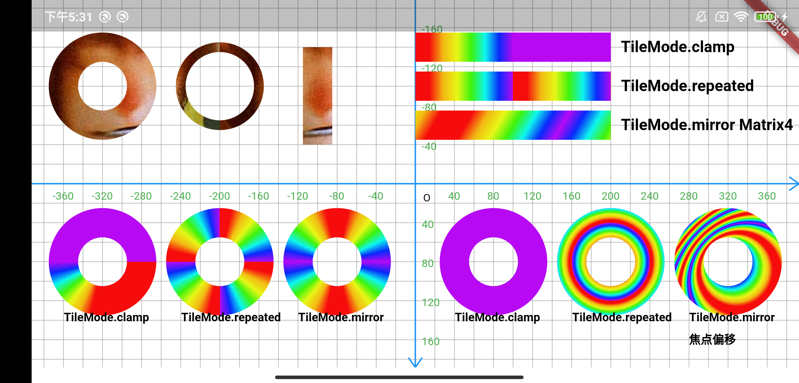

# flutter_custom_view

Flutter 自定义View

## 截图
### Canvas

### 绘制文字

### Path
Path绘制 
[1]. 路径的 [封闭] [重置] [偏移] 操作。 
[2]. 路径的 [矩形边距] 和 [检测点是否在路径中]。 
[3]. 路径的 [路径变换] 和 [路径联合]。 
[4]. 路径测量的用法和作用。 
 
[1]. 如何通过移动路径形成形状：直线移动、圆弧移动、圆锥曲线移动、贝塞尔曲线移动。 
[2]. 路径的 [绝对移动] 和 [相对移动]。 
[3]. 在已有的路径中添加其他形状：添加矩形、圆角矩形、椭圆、圆弧、多边形、其他路径。 
[4]. 使用 path 绘制坐标系。 

### Color
[1].  Dart 中的颜色表示方式。 
 
[2]. 颜色 [混合模式] 的效果。 
 
[3]. 了解如何读取图片中的像素颜色。 
 

[4]. 使用画笔着色器实现渐变效果：线性渐变、径向渐变、扫描渐变 
[5]. 画笔 [图片着色器] 的使用。 
[6]. 画笔 [颜色滤色器]、[遮罩滤镜] 的使用。 
 